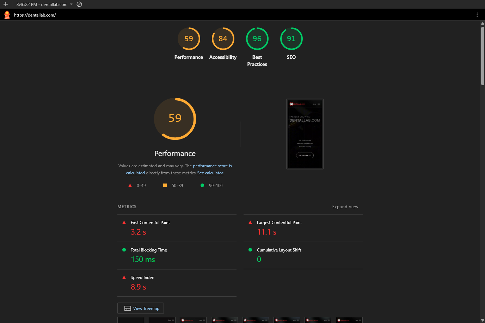
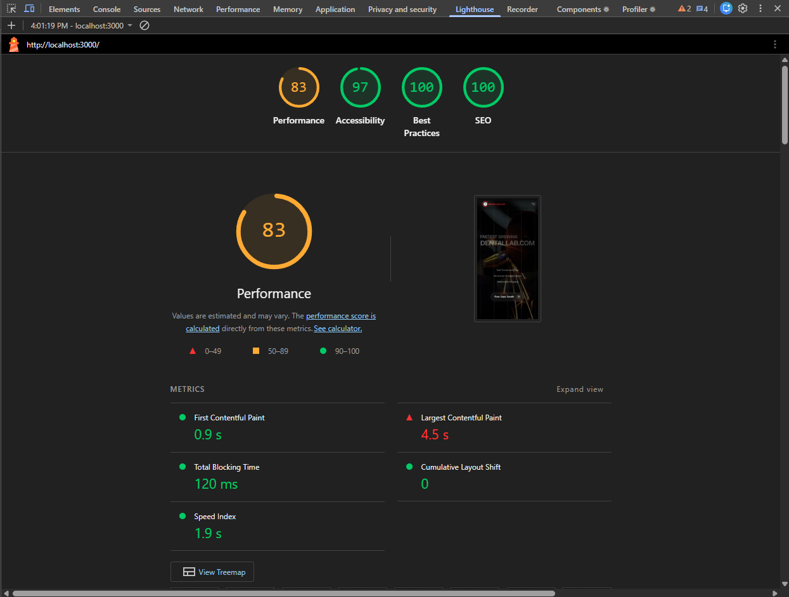
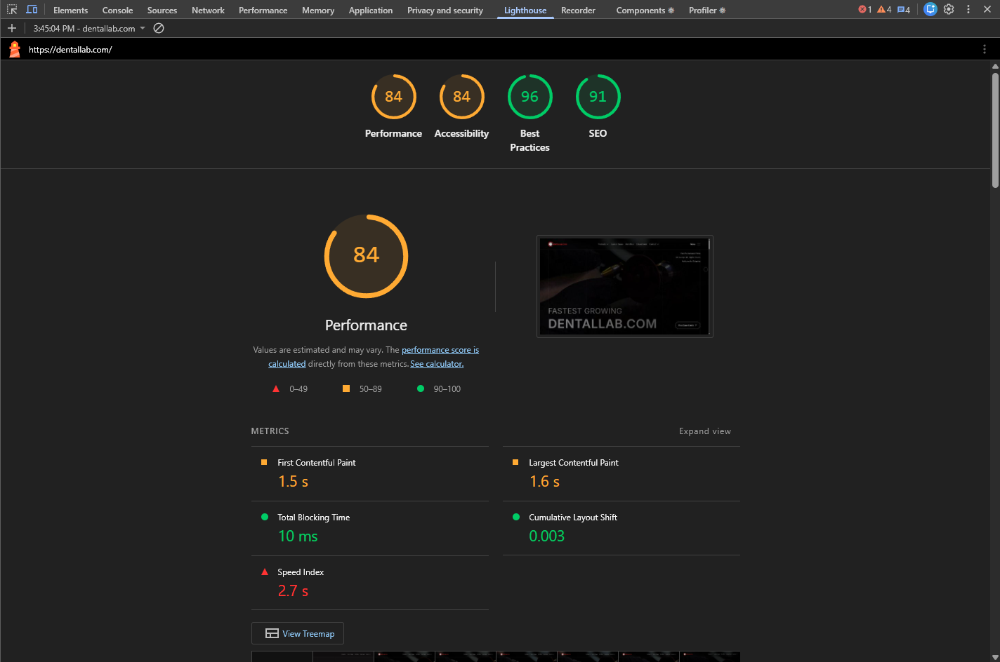
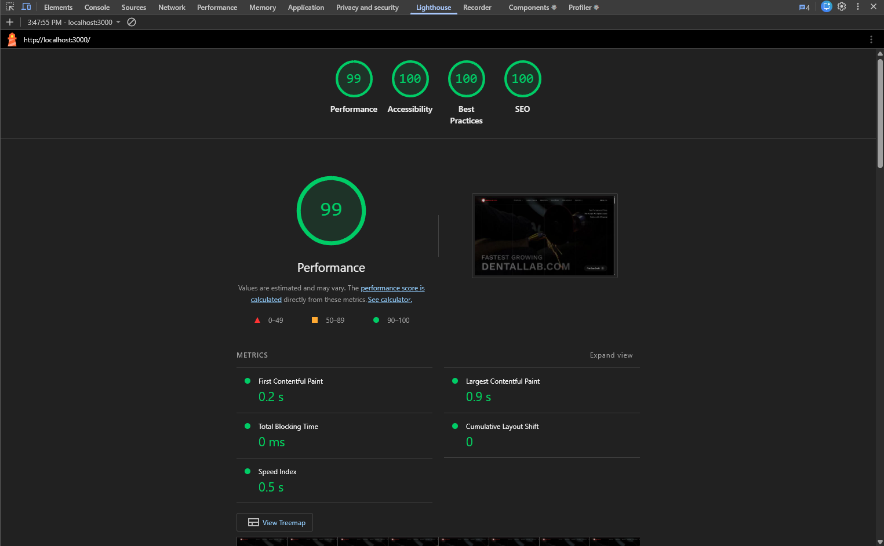

# Next.js Dental Lab SPA - Technical Assessment

**Live Demo**: [https://dentallab-spa.vercel.app](https://dentallab-spa.vercel.app)

---

## Technical Stack

- **Framework**: Next.js 16+ (App Router)
- **Styling**: Tailwind CSS 4.0
- **Animations**: Motion (Framer Motion) & Lenis (Smooth Scroll)
- **Icons/UI**: Lucide React & Sonner
- **Validation**: Zod & React Hook Form
- **Testing**: Vitest with Colocated Test Files

---

## Strategic Improvements

Instead of a pixel-perfect clone, this rebuild focuses on solving core UX and performance bottlenecks identified in the original site.

### 1. Interactivity

- **Magnetic Components**: Critical interactive elements (CTA buttons, social links) feature a high-end magnetic pull effect to grab user attention.
- **Fluid Navigation**: Fixed the snappy/flashy mega-menu transitions. Implemented an "Outside Click" listener and mobile scroll-locking for a more native-app feel.
- **Scroll-Linked Storytelling**: The "Full Arch" section uses synchronized video and text animations to guide the user through technical details.

### 2. Performance-First Media

- **Video Poster Strategy**: Added dynamic poster images to all background videos. This prevents the "black flash" or empty sections while high-res video assets are buffering on slower networks.
- **Optimized Assets**: Leveraged `next/image` with calculated `sizes` and `quality` parameters to ensure minimal layout shift and fast loading on mobile.

### 3. SEO & Semantic Integrity

- **Structured Data**: Implemented **JSON-LD (LocalBusiness)** to improve search engine visibility and rich snippet generation.
- **Metadata Templates**: Professional metadata structure with dynamic title templates and OpenGraph/Twitter card support.
- **Semantic Hierarchy**: Corrected heading levels (`h1`-`h6`) ensuring a logical document outline for both SEO and screen readers.

### 4. Clean Architecture

- **Content Decoupling**: All site text and configuration are centralized in `constants/index.ts`, making content updates trivial without touching component logic.
- **Colocated Testing**: Unit tests (Vitest) are located directly next to the logic they validate (e.g., `schema/contact.test.ts`).

---

## Setup & Installation

Follow these steps to run the project locally:

1. **Clone & Install**:

   ```bash
   git clone <repository-url>
   cd dentallab-spa
   npm install
   ```

2. **Run Development Server**:

   ```bash
   npm run dev
   ```

   Open [http://localhost:3050](http://localhost:3050) to view the result.

3. **Running Tests**:
   ```bash
   npm test
   ```

---

## Project Structure

```text
├── app/                  # Next.js App Router (Layouts, Pages, SEO)
├── components/           # Reusable UI & Section Components
│   ├── (home)/           # Home-specific section components
│   └── shared/           # Cross-component utilities (Magnetic, Forms)
├── constants/            # Site content and configuration
├── hooks/                # Custom hooks (SmoothScroll, ScrollLock)
├── schema/               # Validation schemas and unit tests
└── public/               # Optimized assets (Videos, Icons, Images)
```

---

## Bonus Features Included

- **Accessibility**: ARIA labels, semantic tags, and keyboard-friendly navigation.
- **Unit Testing**: Strategic test coverage for form validation.
- **Robust Contact Form**: Fully validated with Zod, featuring real-time feedback and success toasts.
- **Global Smooth Scroll**: Custom Lenis implementation with hash-link interception for seamless internal navigation.

## Lighthouse Performance Comparison

To validate the improvements, I compared my rebuild against the original reference site using Lighthouse audits for both Mobile and Desktop.

### Mobile Performance

|                                    Original Site                                    |                              Rebuilt Site (This Project)                              |
| :---------------------------------------------------------------------------------: | :-----------------------------------------------------------------------------------: |
|  |  |

### Desktop Performance

|                                  Original Site                                   |                            Rebuilt Site (This Project)                             |
| :------------------------------------------------------------------------------: | :--------------------------------------------------------------------------------: |
|  |  |
